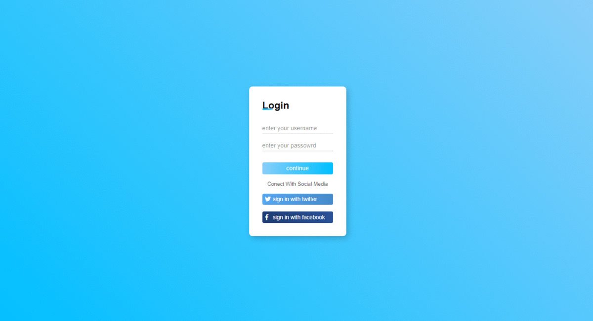

<h1 align="center">
Login
</h1>

    This is a simple and responsive login form made with HTML and CSS using transitions.  
    objective to train Html and CSS and responsiveness.

 
<h2>
   Resources
</h2>

<ol>
    <li>HTML</li>
    <li>CSS</li>
    <li>font awasome</li>
</ol>

<h2>
    Start Dev Environment
</h2>

<ol>
    <li>open git-bash and clone the repository</li>
    <li>Open project folder in VSCode</li>
    <li>Right click index.html > Open with Live Server</li>
    <li>access in your browser and login</li>
</ol>

